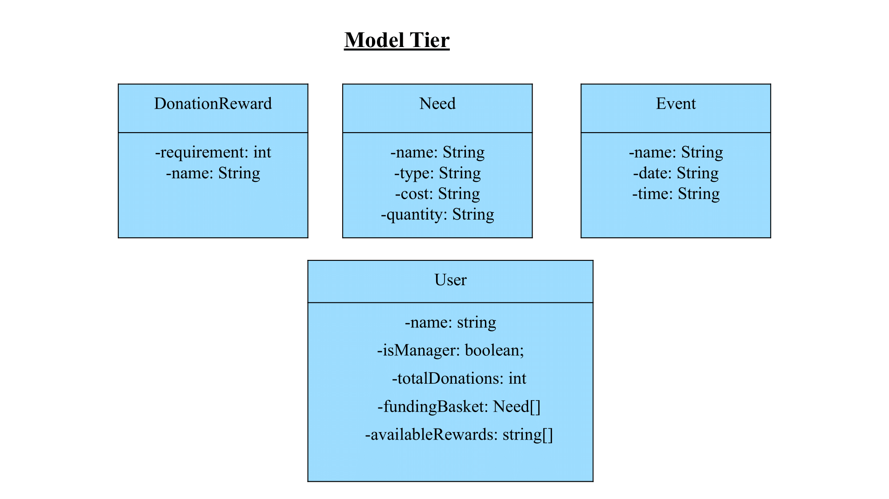

# PROJECT Design Documentation
​
> _The following template provides the headings for your Design
> Documentation.  As you edit each section make sure you remove these
> commentary 'blockquotes'; the lines that start with a > character
> and appear in the generated PDF in italics._
​
## Team Information
* Team name: placeholder
* Team members
  * Justin Wu
  * Daniel Arcega
  * Ricky Yang
  * John Li
​
## Executive Summary
​
This is a summary of the project.
This is a website designed for ArtsRoc, an organization which provides music and lego programs for young kids. It takes in donations from others via items which denote where the money spent will go, shows everybody what events the organization will hold in the future, and provides donation rewards for people who give enough. It also allows for members of the organization, given some permissions, to directly modify the events, the list of stuff people can buy from, and the rewards for donating some amount of money.
​
### Purpose
>  _**[Sprint 2 & 4]** Provide a very brief statement about the project and the most
> important user group and user goals._

This website is for ArtsRoc to help fund its endeavors through outside donations. Users should be able to pick and choose what programs they want to fund and receive rewards for their actions.
​
### Glossary and Acronyms
> _**[Sprint 2 & 4]** Provide a table of terms and acronyms._
​
| Term | Definition |
|------|------------|
| SPA | Single Page |
​
​
## Requirements
​
This section describes the features of the application.
​
> _In this section you do not need to be exhaustive and list every
> story.  Focus on top-level features from the Vision document and
> maybe Epics and critical Stories._
​
### Definition of MVP
> _**[Sprint 2 & 4]** Provide a simple description of the Minimum Viable Product._

The ArtsRoc website that allows people to donate to ArtsRoc's various programs (or/and aspects of said programs). It also allows the people responsible for managing the funds to change what the donors can buy, given the organization wants more funding towards a different set of things than what's there already.
### MVP Features
>  _**[Sprint 4]** Provide a list of top-level Epics and/or Stories of the MVP._
​
<h5>Epic: Account System</h5>
This Epic focuses on the functionalities related to user account management, encompassing both helpers and U-Fund managers.
Register as Helper: Helpers can register for the organization to engage in activities like donations. This feature is crucial for onboarding new users and integrating them into the system.

Browse Needs: This feature allows helpers to view a list of needs or causes, enabling them to decide where to contribute. It's essential for user engagement and directing resources effectively.
U-Fund Manager Abilities/Cupboard Structure: U-Fund managers need access to a 'cupboard' system to create, delete, and update the needs listed. This is pivotal for maintaining and updating the database of needs.

Login to Account: Users, including helpers and managers, can log into their accounts using their username. This access is vital for engaging with personal funding baskets and other features.
Logout of Account: This allows users to log out of their accounts, facilitating account switching or the creation of new accounts, thereby enhancing user flexibility and security.

<h5>Epic: Funding Basket Management</h5>
This Epic centers on the management of a 'funding basket,' a key feature for financial transactions and donations within the website, which essentially acts as a shopping cart for supporters
Subtract from Funding Basket: Helpers have the option to remove items from their funding basket. This feature is important for avoiding accidental purchases and ensuring user control over their donations.

Checkout: This functionality enables users to finalize the items in their funding basket, clearing the basket upon completion. It's a crucial step in the donation process, ensuring a smooth transaction flow.

Add to Funding Basket: Helpers can add multiple fundable items to their basket in a single action. This streamlines the process of selecting and committing to donations.

Browse/Search Needs: Similar to viewing a list of needs, this feature might include more advanced search or filter options to help helpers find specific fundable items or causes.

### Enhancements
> _**[Sprint 4]** Describe what enhancements you have implemented for the project._
​
When a non-admin user meets a certain number of goals or rather spends enough money on funding these goals by checking out needs, they receive fungible points in a one to one ratio that can be redeemed for rewards. Points are an accurate indicator of the account's total spending and they don't decrease after redeeming rewards. Rather, they are a milestone and they reach the required threshold for any rewards, the said rewards can be retrieved/redeemed with a click of a button. There is a different tab where the rewards can be previewed and claimed. Additionally when signing in, there is a popup alerting the user of any unclaimed available rewards.Next to the rewards tab there is a checkout tab, which is used to view the added needs, which can be individually removed by the user by clicking the button to the right of the need in the checkout. Finally at the very bottom there is a button, checkout, which removes all the needs from the funding basket and displays a message upon successful checkout. When there is no needs, the page displays a unique message remarking on the absence of needs in the funding basket.Next to both of these features is the event tab, which displays the events that has been added by the cupboard manager/ admin.All of the above features can be modified by a cupboard manager/admin who can directly interact with the details of needs, events, and rewards(all features which can be updated or created by the cupboard manager/ admin).
​
## Application Domain
​
This section describes the application domain.
​

​
The application domain of our project centers around gathering donations that ArtsRoc can use to improve current and create new programs. According to our domain diagram, the helper is a donor who has a set of items they can purchase in order to help ArtsRoc fund its programs (or aspects of them), and in turn, could get a reward given they’ve donated enough. Said rewards are not automatically provided to the User upon a certain threshold met. They can also see specific events scheduled by the organizations. Said events have a given name, date, and time. The Ufund Manager directly modifies what the helper searches through and buys. They also will have full control over the donation rewards and the event schedule. The checkout manager helps the user manage the set of orders they want to purchase alongside providing a way for them to do such.​​ The authentication system determines who is allowed to log in as a U fund Manager or a helper. The funding basket is something that the user has, and stores all the needs the helper wants. It allows the helper to buy a group of things at once instead of one at a time.
​
​
## Architecture and Design
​
This section describes the application architecture.
​
### Summary
​
The following Tiers/Layers model shows a high-level view of the webapp's architecture. 
**NOTE**: detailed diagrams are required in later sections of this document. (_When requested, replace this diagram with your **own** rendition and representations of sample classes of your system_.) 
​

​
The web application, is built using the Model–View–ViewModel (MVVM) architecture pattern. 
​
The Model stores the application data objects including any functionality to provide persistance. 
​
The View is the client-side SPA built with Angular utilizing HTML, CSS and TypeScript. The ViewModel provides RESTful APIs to the client (View) as well as any logic required to manipulate the data objects from the Model.
​
Both the ViewModel and Model are built using Java and Spring Framework. Details of the components within these tiers are supplied below.
​
​
### Overview of User Interface
​
This section describes the web interface flow; this is how the user views and interacts with the web application.
​
> _Provide a summary of the application's user interface.  Describe, from the user's perspective, the flow of the pages in the web application._
​
The first thing a User sees is a screen that displays the title of the screen, a way to create a new helper and an area to log in as either a Helper or Ufund manager. Said log in and sign in areas only require a username for validation and account creation respectively.

If the user logs in as a Helper they will first see pop ups given they have unclaimed donation rewards. Otherwise, they will first see several tabs at the top, right below a welcome that includes their username: one named “Checkout”, one named “Needs”, one named “Current Events”, and one named “Rewards.” At the bottom they will see a button to log out of their account. Clicking on a tab will replace the previous content between the tabs and the log out button with its respective content. Clicking on the Checkout tab will show the User’s funding basket in the middle of the two, alongside X buttons to the right of a need’s description. Clicking on the X will remove the need from the list. Clicking on the checkout button below removes all of the displayed needs in the funding basket and replaces it with a message that the person has checked out. Clicking on the Needs tab will display all of the needs that someone can buy, and that when the quantity of a need reaches zero it disappears from the display until it is restocked. Clicking on the “Current Events” tab displays the events that a User can attend. Said event has a date, a time of occurrence, and a name/description. Clicking on the Rewards will display below the tabs all the rewards that a User could get alongside the total donations the User made to the organization. Below that, they will see what rewards the user can get at the moment. These are represented by buttons. If one of these buttons are clicked, they vanish from the display and imply the User got the corresponding reward. Clicking on the log out button by the bottom of the application will make the initial login screen appear.

Logging in as a Ufund Manager will make the application display three tabs instead at the top: “Rewards Management,” “Need Management,” and “Event Management.” All of the page parts these display are functionally the same, with different descriptions of what a valid set of inputs are. In general, all of them have said descriptions at the top part, the middle consisting of a list of the existing data, represented as buttons, to be handled. Each button representing an item has an X button to its right, which, when clicked on, deletes its corresponding item from the display (and the database). Below this list is a set of fields that each represent some quality of the item. To the right of these fields is a button that, when clicked, adds a new or edits an existing thing, if valid data is given.

​
### View Tier
> _**[Sprint 4]** Provide a summary of the View Tier UI of your architecture.
> Describe the types of components in the tier and describe their
> responsibilities.  This should be a narrative description, i.e. it has
> a flow or "story line" that the reader can follow._
​
> _**[Sprint 4]** You must  provide at least **2 sequence diagrams** as is relevant to a particular aspects 
> of the design that you are describing.  (**For example**, in a shopping experience application you might create a 
> sequence diagram of a customer searching for an item and adding to their cart.)
> As these can span multiple tiers, be sure to include an relevant HTTP requests from the client-side to the server-side 
> to help illustrate the end-to-end flow._
​
> _**[Sprint 4]** To adequately show your system, you will need to present the **class diagrams** where relevant in your design. Some additional tips:_
 >* _Class diagrams only apply to the **ViewModel** and **Model** Tier_
>* _A single class diagram of the entire system will not be effective. You may start with one, but will be need to break it down into smaller sections to account for requirements of each of the Tier static models below._
 >* _Correct labeling of relationships with proper notation for the relationship type, multiplicities, and navigation information will be important._
 >* _Include other details such as attributes and method signatures that you think are needed to support the level of detail in your discussion._
​

Our view tier is made purely of Angular and utilizes services, directives, and components. The main components consist of two types: the ones that display to the user one thing the organization has (rewards for donations, needs that can be bought, etc.) and the ones that group which ones the user could see based on their status (manager, helper). Both types are connected through a routing system. For instance, the diagram below demonstrates how someone could add a need, starting from the component responsible for showing the user (in this case a manager) edits and adds needs to the database.

![Sequence diagram for editing the cupboard.]
(AddOrEditNeedsSequenceDiagram.drawio.png)

This diagram skips the part of the manager authenticating themselves through the login screen, which is part of the main page. The HTTP requests associated with this function are PUT and POST, responsible for editing a resource (given the need is already in the database) and creating new ones (given it doesn’t exist yet). Another example of the components responsible for some function is given below:

![Sequence diagram associated with how a user can add a new need to their funding basket.]
(Team8-Ufund-Diagram.png)

This diagram above demonstrates how a user can add a new need to the funding basket. This diagram doesn’t include the user authenticating themselves through the login page and later clicking on the link that brings them to where they can add needs to their funding basket. As demonstrated here, the HTTP request associated with this function is PUT, given an existing resource (the user in this case) is updated (to add a new need to their funding basket). In general, for both of the above java classes associated with the functions, the controllers and DAOs that handle the HTTP requests and data respectively have been generalized to resemble the following:

![Relationship diagram between the controller and persistence sub-tier.]
(viewModelModelRelationship.png)

ControllerInterace.java and DataFileDAO.java are both generic in order to help them deal with different data classes that all share a unique identifier with the same type(string in this case). Generally, when receiving an HTTP request from the Angular component, the Controller will call the functions of its respective DAO in order to modify the data. It will later return objects of the specified type it has been given (UserController.java will send User.java objects to the front end, etc.). Below is a diagram of how a DAO object in the persistence classes interacts with the database.

![Relationship diagram between the persistence subtier, data class sub-tier, and the database.]
(persistenceDatabaseRelations.png)

The “Users” member of the UserFileDAO represents a list of key value pairs, with the name of the resource the key and the actual data the value. This was so the DAO only needed to minimize the amount of reads needed for accessing data. The filename is from where the ObjectMapper will read. The ObjectMapper is what actually reads and writes data to the file (Users.json in this case), with the DAO’s respective data class as the formatting. These members are what all of the DAOs in the system have. The respective data class, which is User.java in this case, will be created and sent to the Controller to later be sent to the frontend.
The second type more or less consists of two parts: the main application page, which displays the router output (i.e. components such as the ones described in the diagrams above) and the main-body component, which determines which links the user is allowed to see (and ultimately use).

### ViewModel Tier
> _**[Sprint 4]** Provide a summary of this tier of your architecture. This
> section will follow the same instructions that are given for the View
> Tier above._
​
> _At appropriate places as part of this narrative provide **one** or more updated and **properly labeled**
> static models (UML class diagrams) with some details such as critical attributes and methods._
> 

​
### Model Tier
> _**[Sprint 2, 3 & 4]** Provide a summary of this tier of your architecture. This
> section will follow the same instructions that are given for the View
> Tier above._
​
> _At appropriate places as part of this narrative provide **one** or more updated and **properly labeled**
> static models (UML class diagrams) with some details such as critical attributes and methods._
> 

​
The model tier is an intermediary between the objects that can be modified by the frontend Angular section and the JSON database. There are two main classes in this tier: User.java and Need.java. User.java represents the individual data of a user, while Need.java represents a need that could be bought by a user. Need.java contains a price, a name which acts as the unique id to prevent duplicates, a tag which can be used to filter out details, and finally a quantity. User.java contains the username, the current items that the user will buy, if it is an admin or not, the total amount of money they spent, and a list of donation rewards they can get given some amount of points. DonationReward.java represents the reward that a user can get, given some amount of money they've spent in total. It contains a name and a number representing the amount of money needed to get it. Event.java contains data pertaining to an event the organization may hold, such as the name and the date and time it will occur.
​
## OO Design Principles
> _**[Sprint 2, 3 & 4]** Will eventually address upto **4 key OO Principles** in your final design. Follow guidance in augmenting those completed in previous Sprints as indicated to you by instructor. Be sure to include any diagrams (or clearly refer to ones elsewhere in your Tier sections above) to support your claims._

<h5>Open/closed</h5>

​
The way the DAO and Controller objects are designed are under the assumption that there will be similarities in how the data is handled. Specifically, for the DAOs, if all objects serialized and deserialized will have a string as a unique identifier and are organized the same way, then there could be a common interface that is used. The controllers which each handle different types of data(User, etc.), on the other hand, all handle the transmission of data via http the same. Therefore each one inherits a common abstract class with all https methods implemented: the only difference is that each class uses a different path for accessing data and themselves for the logger (in order to show which controllers are called).

​
<h5>Single Responsibility</h5>
​

Each class has a single responsibility. For instance, the User.java class handles data pertaining to individuals who use the website, while the DAO classes each handle deserialization/serialization of a given object. The controller objects each handle a different DAO and link the app to whatever uses the database. Each class in the model tier is purposed to handling some unique data, be it a user, which contains admin permissions, the name, and the items in their basket, or a Need, which has a cost, name, quantity, and type. As a result, the program needs less time to decipher what data it needs to look at.

<h5>Pure Fabrication</h5>

Each class in the backend has some specific responsibilty despite not having a defined role in the domain diagram. For instance, the use of controller and DAO (data persistence oriented) classes help abstract the translation of json objects to java objects(and vice versa) from the handling of http requests. This is also exemplified in the front end, where services prevent the repetition of code needed to send http requests and process http responses.
​

<h5>Dependency Inversion</h5>

In the backend, the Controller classes in the view model tier consist of objects in the model tier to function. If said models in the object tier are untested by the controller objects are, then they can be mocked by a testing framework such as Mockito to simulate how it’s supposed to function, so it can therefore be tested without needing to test the DAOs and the data classes first. This also prevents the tester from mistaking bugs in the DAO objects with those in the controller. This also applies to the objects in the persistence layer, which uses an Object Mapper.

​
> _**[Sprint 3 & 4]** OO Design Principles should span across **all tiers.**_
​
## Static Code Analysis/Future Design Improvements
> _**[Sprint 4]** With the results from the Static Code Analysis exercise, 
> **Identify 3-4** areas within your code that have been flagged by the Static Code 
> Analysis Tool (SonarQube) and provide your analysis and recommendations.  
> Include any relevant screenshot(s) with each area._
​
> _**[Sprint 4]** Discuss **future** refactoring and other design improvements your team would explore if the team had additional time._
​
## Testing
> _This section will provide information about the testing performed
> and the results of the testing._

User Stories and Unit Tests: The majority of the user stories were successfully implemented without significant issues. All the unit tests that were executed passed, ensuring the functionality adhered to the predefined criteria. Ufund Manager Story Testing: Testing the ufund manager story demonstrated that all the functionalities met the expected criteria. During live testing, users were able to interact with the cupboard and funding basket, performing operations such as adding items to the funding basket and canceling or reverting actions by clicking outside the designated buttons. Helper Stories Testing: The add and subtract functionalities for the funding basket were tested thoroughly, and both met the acceptance criteria. Live testing confirmed that users could add multiple needs to the funding basket and remove them accordingly. Both the subtract and add operations supported quantity increments and decrements as expected. User Login and Logout Testing: The user login, sign-up, and logout functionalities were found to be satisfactory, considering that the input was not entirely composed of whitespace. The sign-up process ignored usernames that already existed, while the login process verified the credentials against existing records. Successful login granted users access to the funding basket and associated functionalities, and the logout process effectively restricted access to the account until re-login. Search Functionality Testing: The search functionality successfully filtered results from the original list of fundable items, as expected. The fundable items were displayed in a list grid format, consistent with the predefined acceptance criteria. Checkout Functionality Issue: While the checkout functionality seemed to meet the criteria during unit testing, there was an issue with updating or refreshing the funding basket after checkout in the live testing phase. This issue requires further investigation to ensure the funding basket is appropriately updated and refreshed post-checkout.

​
​
### Acceptance Testing
> _**[Sprint 2 & 4]** Report on the number of user stories that have passed all their
> acceptance criteria tests, the number that have some acceptance
> criteria tests failing, and the number of user stories that
> have not had any testing yet. Highlight the issues found during
> acceptance testing and if there are any concerns._
​

The majority of the user stories passed without much issues and all the unit tests that we tested passed. For the ufund manager story, all of them performed to our expectations. During our live testing of the website the, user/helper was able to interact with the need in the cupboard to add it to the funding basket as well as any functionality such as cancelling/reverting the operation of moving the needs by clicking anywhere but the button responsible for moving it to the funding basket. The helper stories, add and subtract to/from funding basket also met our acceptance criteria and in live testing on the webpage, add and subtract performed to our expectations, the add was able to add multiple needs to the funding basket and the subtract was able to take them out. Both the subtract and the add worked with quantity increment and decrements. The user log in, sign up, and logout stories also performed sufficiently in the case that the input was not entirely compose of whitespace. In the event that a username already existed the sign up would ignore it. The log in would match the credentials of with existing ones in the system otherwise it would ignore them. Once logged in the user had access to the funding basket to add needs, remove needs as well as any functionality given to users. The live testing confirmed that the log out worked and made sure that the user had lost access to their account as well as any functionality tied to having an account until they logged back in. Our search story also performed to our expectations since it would filter out results from our original list of fundable things. The fundable things were also displayed in a list grid format as consistent with our acceptance criteria. However, while the checkout functionality seemed to meet the criteria for the checkout story in unit testing there was an issue with updating/refreshing the funding basket after checkout (where checkout consisted of clearing the funding basket) during live testing

​

​
### Unit Testing and Code Coverage
> _**[Sprint 4]** Discuss your unit testing strategy. Report on the code coverage
> achieved from unit testing of the code base. Discuss the team's
> coverage targets, why you selected those values, and how well your
> code coverage met your targets._

​

Our unit testing strategy involved testing functions of similar functionality. For instance, if a function for getting and setting a primitive value of a class, then others that do the same thing with different types of primitives don’t need to be tested. For the DAOs in particular, if we know that two branches require the opposite conditions to happen, and if one branch works given a specified output, then there is no need to test the other as it would produce the intended result. The main goal of our code coverage was at least 90%, given that while we wanted to make sure all major features were covered, we didn’t want to waste time on testing functions that we knew would already work, given one or more of the reasons discussed previously.

​

​
>_**[Sprint 2 & 4]** **Include images of your code coverage report.** If there are any anomalies, discuss
> those._

​

​

​The persistence tests do not test for failures. We did not think this was needed, given they work anyways in the live testing area.

Most of the uncovered code are the getters and setters in the Need.java object. Our group thought that if one getter worked, then the others would, given all the untested ones handled primitive values. As of writing, the cupboard.java object has been removed. A branch involving two objects not being equal in the equals function of User.java isn't covered either, mainly because they don't have anythign in particular outside of a return value. As of now, the charge object does not have any tests.